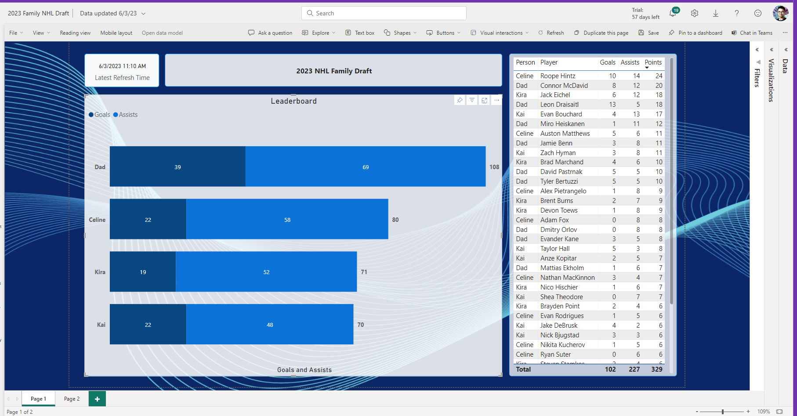
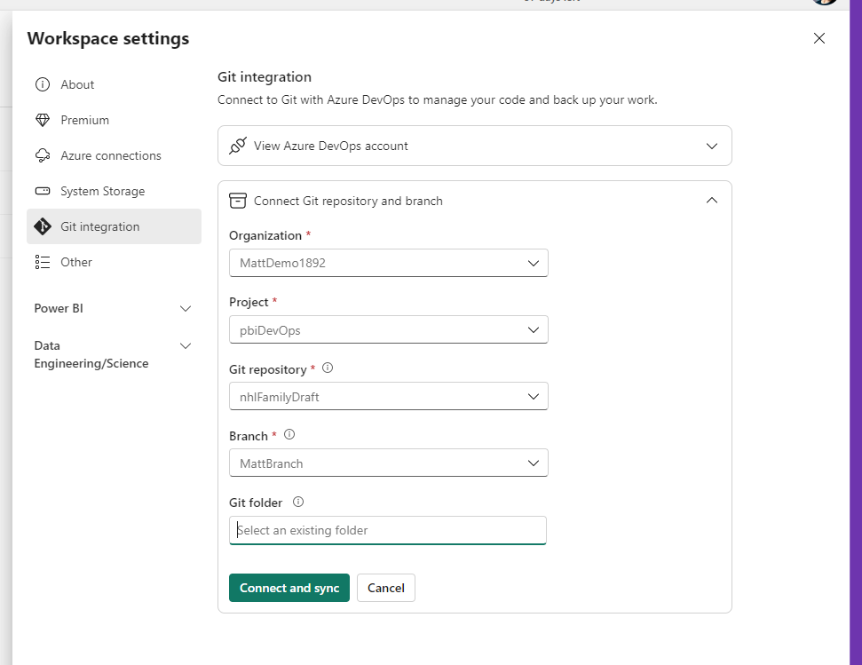
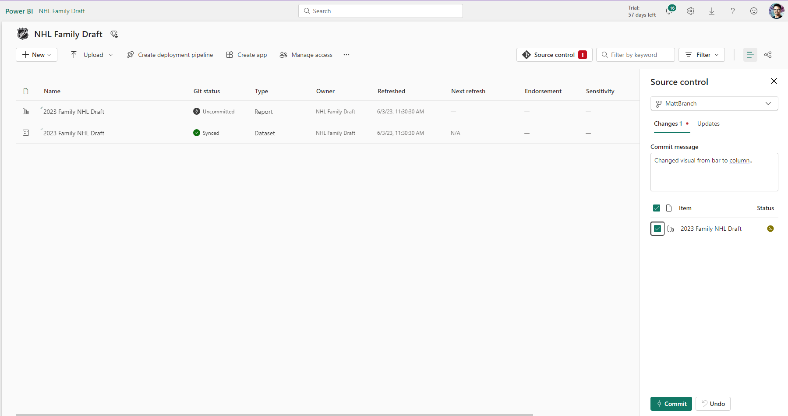
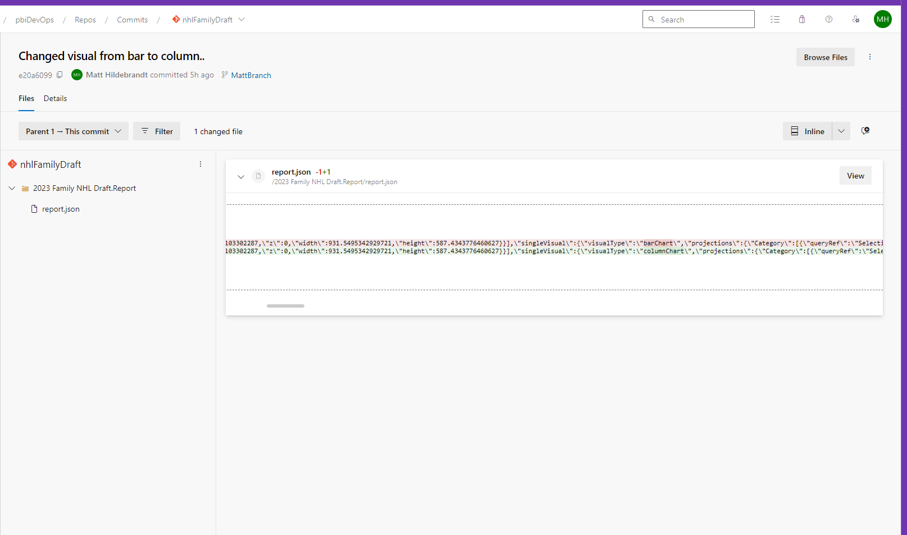
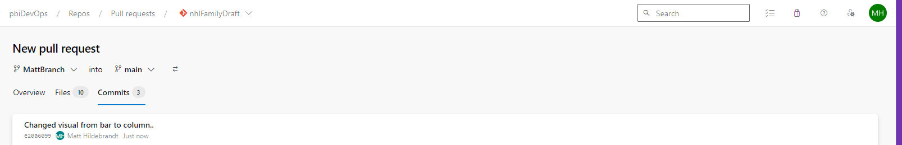
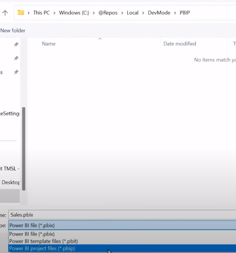
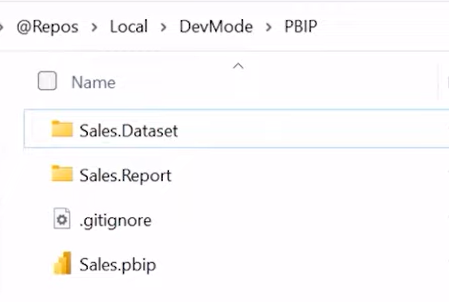
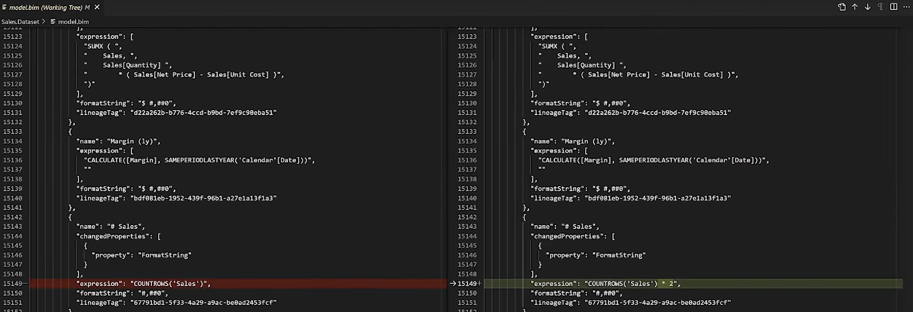
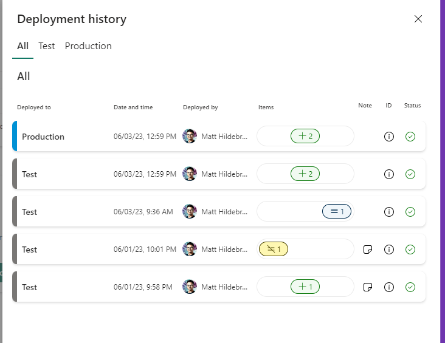

# DevOps, CI/CD, APIs and  Power BI
### Along with the announcement of Fabric came a plethora of developer experience upgrades that improve PowerBI's relationship with DevOps and CI/CD. 
### Here are 5 to take note of:


1.	Integrate Git with Power BI Service. 
2.	Source control with new Power BI Project (PBIP) file type. 
3.	View your deployment history in Power BI Service. 
4.  Roll back changes in PBI Service.
4.	Automate deployment with Power BI REST APIs.

# 1. Integrate Git with Power BI Service.

You can now sync a Git Repo to a Workspace in the Power BI service.  
To show this I created a 2023 NHL Family Draft Report that scrapes the NHL’s website for playoff points and integrates our draft selections to create visuals to see who’s in the lead on any given day.  
One of the family stakeholders says “I don’t like the bar chart Dad, please change it to a column chart.”   
Now in pictures here’s how I went about this change request and integrating with Git. 

## Current Report


## Requested Change


## Git Configuration with Azure DevOps


## Commit from the Power BI Service.


## View Diff in Azure DevOps


## Include in PR

# 2.	Source control with new Power BI Project (PBIP) file.
## The PBIP Power BI Project File will allow Git for PBI Desktop. 


  



## Dataset Files contains:
    1. definition.pbidataset
    2. model.bim
## Report files contains:
    1. definition.pbir
    2. report.json  
   
## View your changes made in Power BI Desktop

 

# 3.	View your deployment history in Power BI Service. 


# 4.  Roll back changes in PBI Service.


# 5.	Automate deployments with Power BI REST APIs.
```http
POST https://api.powerbi.com/v1.0/myorg/pipelines/a5ded933-57b7-41f4-b072-ed4c1f9d5824/deployAll
```
```json
{
  "sourceStageOrder": 0,
  "options": {
    "allowOverwriteArtifact": true,
    "allowCreateArtifact": true
  },
  "note": "Deploying business ready items"
}
```
```json
{
  "value": [
    {
      "id": "1065e6a3-a020-4c0c-ada7-92b5fe99eec5",
      "type": "Deploy",
      "status": "NotStarted",
      "lastUpdatedTime": "2020-12-13T09:26:43.153",
      "executionStartTime": "2020-12-13T09:25:43.153Z",
      "executionEndTime": "2020-12-13T09:26:43.153Z",
      "sourceStageOrder": 0,
      "targetStageOrder": 1
    }
  ]
}
```

